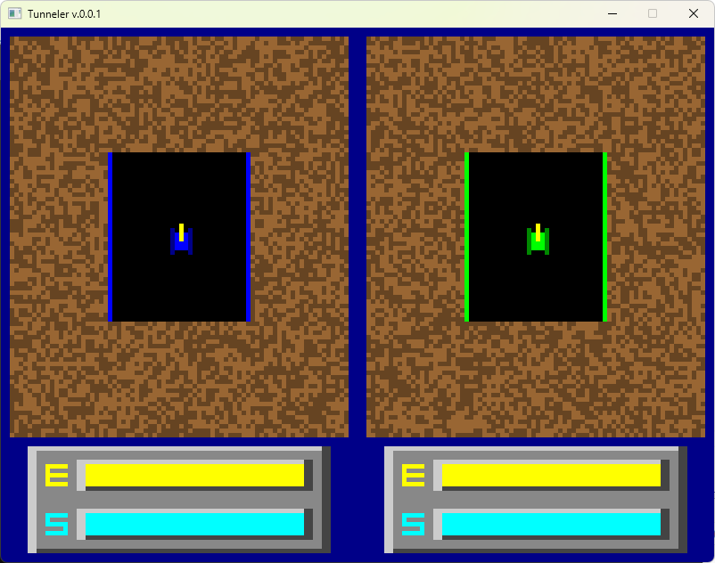

# Sample.Zig.Tunneler

- This project is a small Tunneler implementation for learning Zig while keeping up with changes across Zig/SDL versions.
  - based on [SDL Tunneler](https://users.jyu.fi/~tvkalvas/code/tunneler/). by [Taneli Kalvas](https://users.jyu.fi/~tvkalvas/)
  - origin by [Geoffrey Silverton](https://tunneler.org/faq/)

## ScreenShot



## License

- [GNU General Public License, version 2](./LICENSE.md)

## Used

- [zig](https://ziglang.org/)
  ``` cmd
  > zig version
  0.16.0
  ```
- Lib: [libsdl-org/SDL](https://github.com/libsdl-org/SDL)
- IDE: [LuckystarStudio.ZigVS](https://marketplace.visualstudio.com/items?itemName=LuckystarStudio.ZigVS)